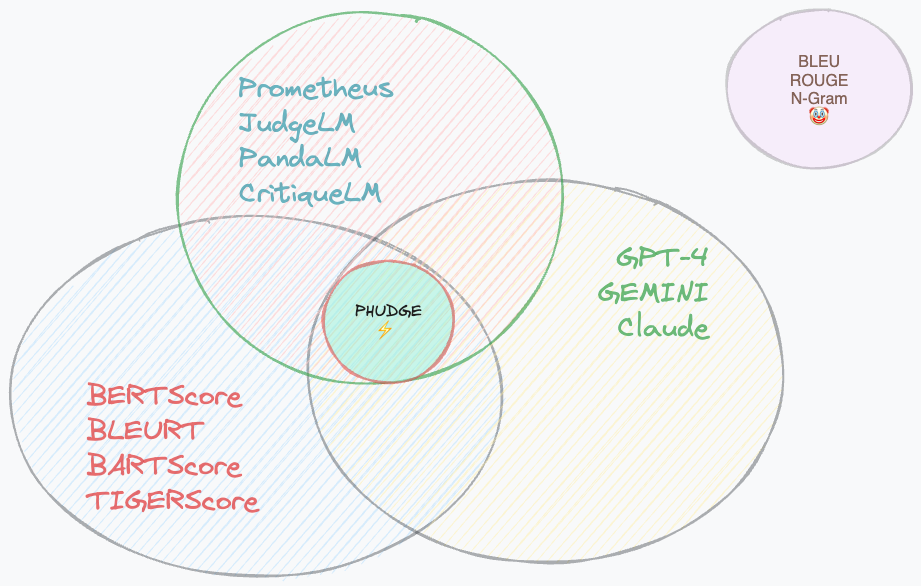
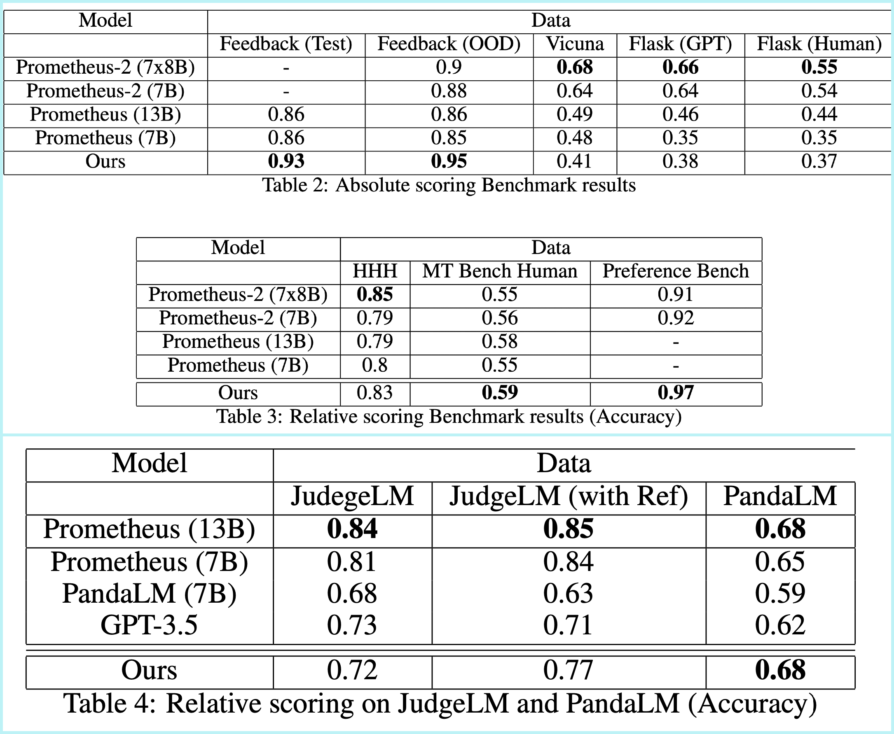

# PHUDG3: Phi-3 as Scalable Judge]

> `3` is for [The Legend](https://en.wikipedia.org/wiki/The_Eminem_Show)  himself

# 
[Paper Link](https://arxiv.org/abs/2405.08029)

# What is it?
A robust production grade and scalable SOTA (4 Benchmarks) model for Relative and Absolute grading of LLM (as well human) responses. 

### What it can do?

Given a question and it's response, it can judge the quality of response from a scale of 1-5. It is trained to be used in Absolute (1 Question - 1 Answer) bt can be used as Relative task too. It is supposed to work on Reference free settings too. So you can uSe it as following:

1. Question + Response to evaluate
2. Question + Response to evaluate + Custom Rubric (scoring criteria for your business use case)
3. Question + Response to evaluate + Custom Rubric + Reference Answer (A high Quality Answer which serves as the base)
4. TO-DO: Question + Response to evaluate + Custom Rubric + Reference Answer + Context (it could be a document, a wikipedia etc)

**The more context you can provide, the better it'll perform**

# Benchmark Results
It is currently SOTA in 4 benchmarks depite being 10x smaller than Prometheus-2 and being trained on one third of the data. On the other hand, it is second best for JudgeLM and better than PandaLM in Zero Shot settings given the model hasn't seen any of the data from these two benchmarks in it's training at all.

# How to use?
Install all the libraries using `sh ./scripts/create_conda_env.sh` or install them one by one using the version from the file. 

**NOTE**: For `transformers` I have used the dev version as of 12/05/2024 but in future, Phi-3 will be available in the main version. This code works perfectly with `Python 3.10 + A10 GPU`. Look for the version you are using. I repeat, use the same versions given in the file.
## Train
**NOTE**: Deepspeed uses some default configuration from a `yaml` file so **DO CHANGE THE CONFIGURATION** in the `/scripts/accelerate_default_config.yaml
` based on your system and save it to `~/.cache/huggingface/accelerate/default_config.yaml`.  For example, if you have 8 GPU, you change the `num_processes1 from 4 to 8.
1. Go to respective `classif, causal, reg` directories and create data using the steps given there
2. Each every type of training file type along with their commands to run is given in the `/scripts`. For example, if you need to train a Regression model without the augmentation, you use the command `accelerate launch ./train_phi-3-reg_classif.py --deepspeed "auto"`.

 ## Test - ([Kaggle Notebook Link](https://www.kaggle.com/deshwalmahesh/phudge-inference))
 Got to `/evaluations/EVAL.ipynb` and follow instructions OR follow the steps below:
 1. Load the model
 2. Attach LoRA
 3. Predict 

# Data & LoRA Weights
[Modified Feedback Collection Data](https://www.kaggle.com/datasets/deshwalmahesh/prometheus-with-wiki-reference)
