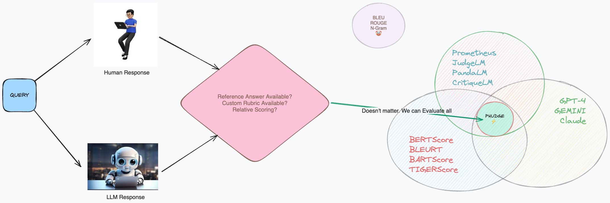

# PHUDG3: Phi-3 as Scalable Judge

> `3` is for [The Legend](https://en.wikipedia.org/wiki/The_Eminem_Show)  himself

# 

# How to use?
Install all the libraries using `sh ./scripts/create_conda_env.sh` or install them one by one using the version from the file. 

**NOTE**: For `transformers` I have used the dev version as of 12/05/2024 but in future, Phi-3 will be available in the main version. This code works perfectly with `Python 3.10 + A10 GPU`. Look for the version you are using. I repeat, use the same versions given in the file.
## Train
**NOTE**: Deepspeed uses some default configuration from a `yaml` file so **DO CHANGE THE CONFIGURATION** in the `/scripts/accelerate_default_config.yaml
` based on your system and save it to `~/.cache/huggingface/accelerate/default_config.yaml`.  For example, if you have 8 GPU, you change the `num_processes1 from 4 to 8.
1. Go to respective `classif, causal, reg` directories and create data using the steps given there
2. Each every type of training file type along with their commands to run is given in the `/scripts`. For example, if you need to train a Regression model without the augmentation, you use the command `accelerate launch ./train_phi-3-reg_classif.py --deepspeed "auto"`.

 ## Test
 Got to `/evaluations/EVAL.ipynb` and follow instructions OR follow the steps below:
 1. Load the model
 2. Attach LoRA
 3. Predict 
